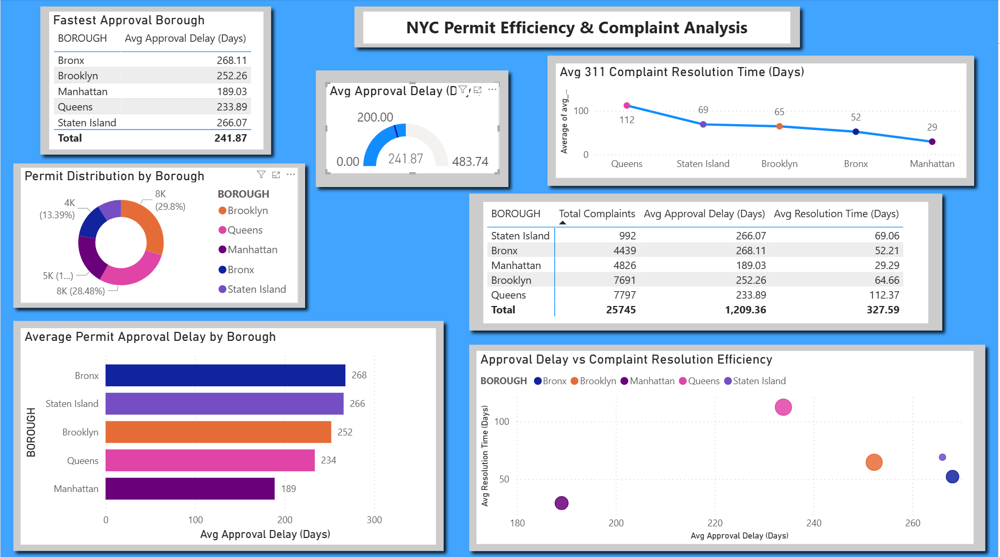

# NYC Permits & 311 Service Efficiency Analysis

## 📊 Project Overview

This project analyzes New York City permit processing efficiency and 311 complaint resolution times across boroughs. The goal is to identify operational inefficiencies and compare how different boroughs handle approvals and public service requests.

By combining permit data, approved permits, and 311 service requests, this project highlights trends in administrative delays and service responsiveness.

---

## 🧰 Tools Used

* Python (Pandas)
* SQL (SQLite)
* Power BI
* Excel (data source)

---

## 📁 Dataset Summary

This project uses three datasets:

* **Permits Data** → Filing & issuance timelines
* **Approved Permits Data** → Approval and issuance delays
* **311 Service Requests** → Complaint resolution times

---

## 🔧 Data Processing (Python)

* Cleaned and standardized borough names
* Converted date columns into datetime format
* Created new features:

  * `days_filing_to_issuance`
  * `days_approved_to_issued`
  * `days_to_close`
* Aggregated data at borough level

---

## 🗄️ SQL Analysis

* Stored datasets in SQLite database
* Performed joins across datasets
* Calculated:

  * Average approval delays
  * Average complaint resolution times
  * Total complaints per borough

---

## 📊 Key Insights

* **Manhattan** shows the fastest resolution times and lower approval delays
* **Queens** has the longest complaint resolution time (~110+ days)
* **Bronx & Staten Island** show slower permit approval timelines
* High complaint volume often correlates with longer resolution times

---

## 📈 Dashboard (Power BI)

The dashboard visualizes:

* Permit approval delays by borough
* 311 complaint resolution times
* Total complaints (bubble size in scatter plot)
* Borough efficiency comparison

---

## 📸 Dashboard Preview

---

## 📂 Project Files

* `powerbifinal.ipynb` → Python analysis
* `final_summary.csv` → cleaned dataset
* `SQL queries` → included in notebook
* `powerbi.pdf` → dashboard export

---

## 💡 Key Takeaway

This project demonstrates how combining multiple data sources can uncover inefficiencies in both administrative processes and public service systems.

---

## 📫 Contact

* LinkedIn: https://www.linkedin.com/in/jaden-boothe-29b8873b9/
* GitHub: https://github.com/Jay330-creator
